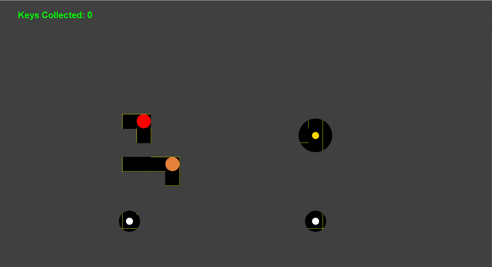

# Welcome to Java Projects

This repository holds Java games that I have developed and would like to showcase.

## Playing the games

Currently there are two games. You can play them by clicking the titles of the games:

### <a href="https://github.com/rogov-dvp/Java-Projects/tree/master/PLAYME">Malzar's Maze</a> 

> A game in which a player traverses in a maze with limited visibility and collects keys while a minotaur chases them.

### <a href="https://github.com/rogov-dvp/Java-Projects/tree/master/PLAYME">Brick Breaker Game</a>

> A simple game of bouncing a ball off a paddle and breaking bricks.

## Information on the games

Malzar's Maze is by far the most intricate and unique of the two games. So let's start with it first.

[Click here](#brick-breaker-game-1) to jump to "Brick Breaker Game".

## Malzar's Maze

(1) This is the first page you see when starting the game.

  
(2) This page gives a story and background about the game. 

The story goes that the player is on an expedition in an deep underground maze to find treasures while there is hints of a minotaur hunting him.

(3) The controls and gameplay of the game are found here.

Controls consist of arrow keys (up, down, left, right). Gameplay explains that there are four objects in the game: player (orange ball), white key (small white ball), gold key (small gold ball), and a minotaur (red ball). The player must navigate through the maze and collect keys to win; Meanwhile, the minotaur chases the player.

(4) The difficulty page changes the difficulty on the game. There are four difficulties to select, 'one' being the easiet and 'four' being the hardest. The difficulty changes the speed of the minotaur. After selecting an option, the game begins.

(5) Finally, the start of the game. There is no time limit, and the minotaur does not appear until the player has left a small radius from the starting point. The player is granted vision of all three keys. Aswell, the player has vision of the entire maze until the player makes a valid move.

(6) The minotaur starts at the same location as the player once the player leaves a specific radius from that point.  Apart from the start of the game, the player does not have vision of the minotaur unless the minotaur is in range of the player's limited vision.

(7) The player's vision is based on the surrounding walls which is close to what would be seen in real life. This makes every turn intense as the player apprehensively guesses if the minotaur is waiting around the corner. 

(8) In the case of the player begin caught by the minotaur, they are given the screen below. They are given two options:

1. One, restart with a new random-generated maze with same difficulty. 
2. Two, go back to difficulty options page to change difficulty and reload the same maze (with new random white-key locations).

(9) In the case of the player collect all keys and wins, they are given the screen below. Given with the same two options:

1. One, restart with a new random-generated maze with same difficulty. 
2. Two, go back to difficulty options page to change difficulty and reload the same maze (with new random white-key locations).

## Brick Breaker Game
